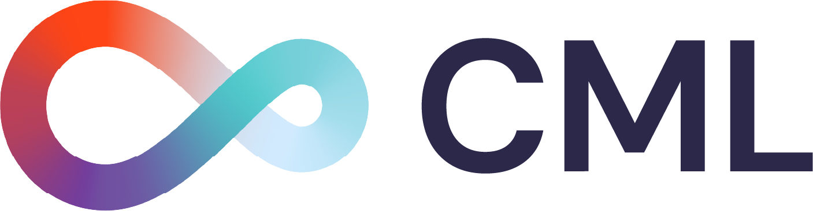
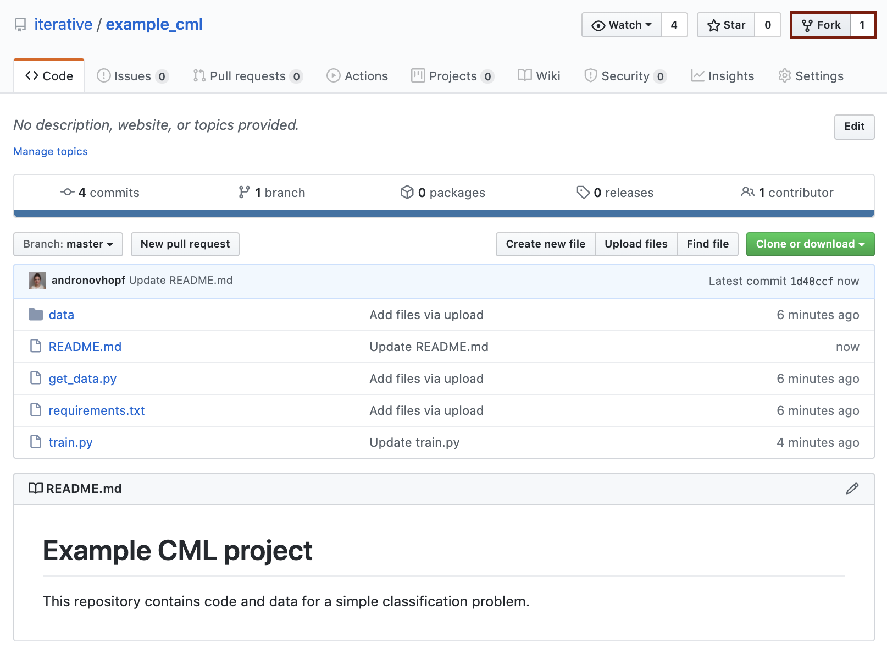
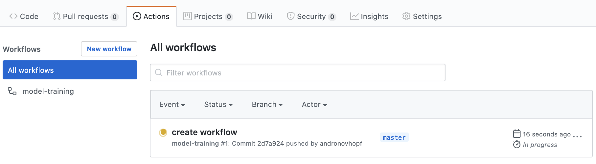
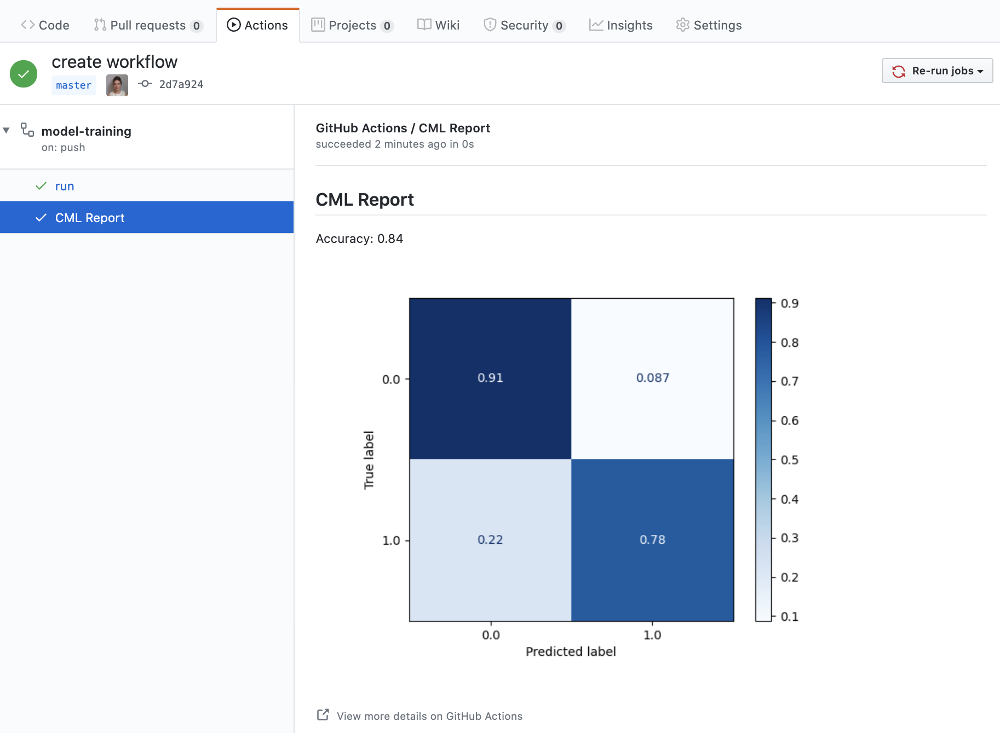
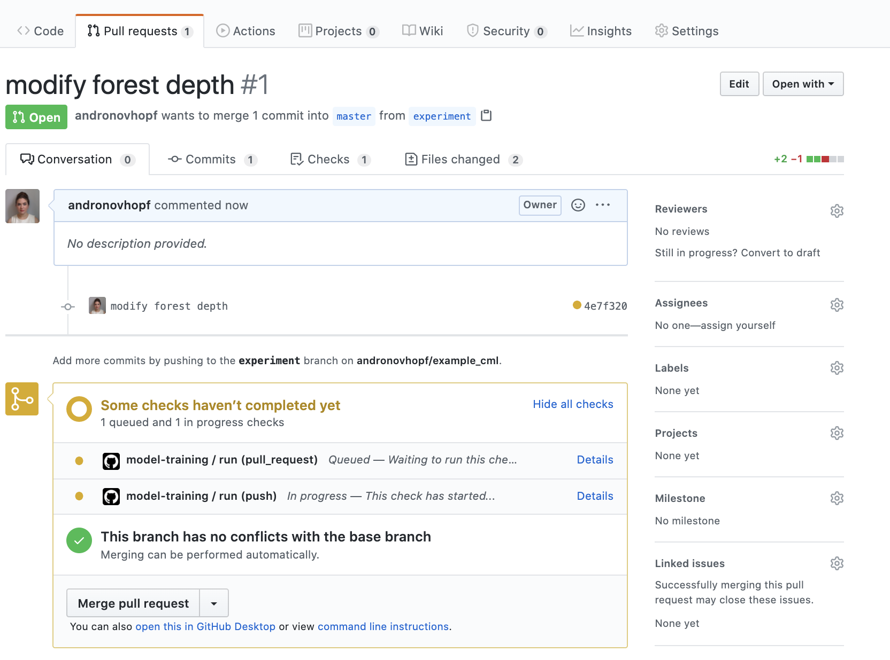
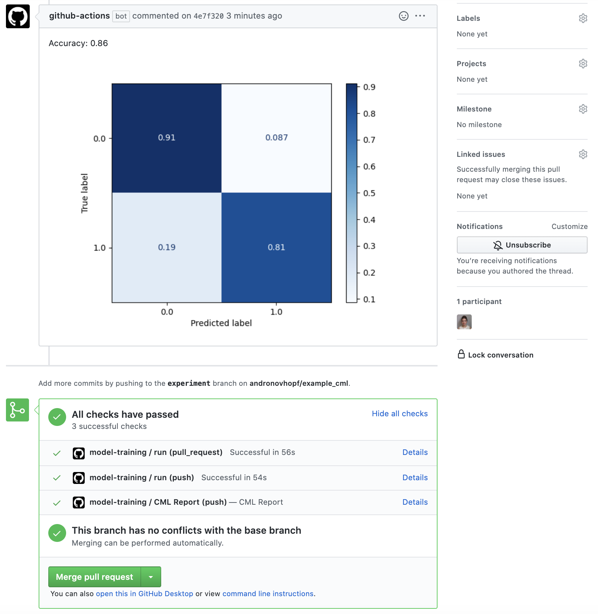
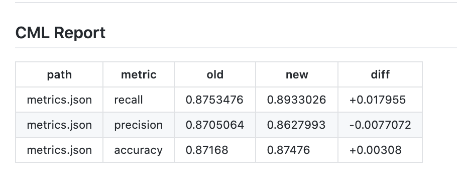
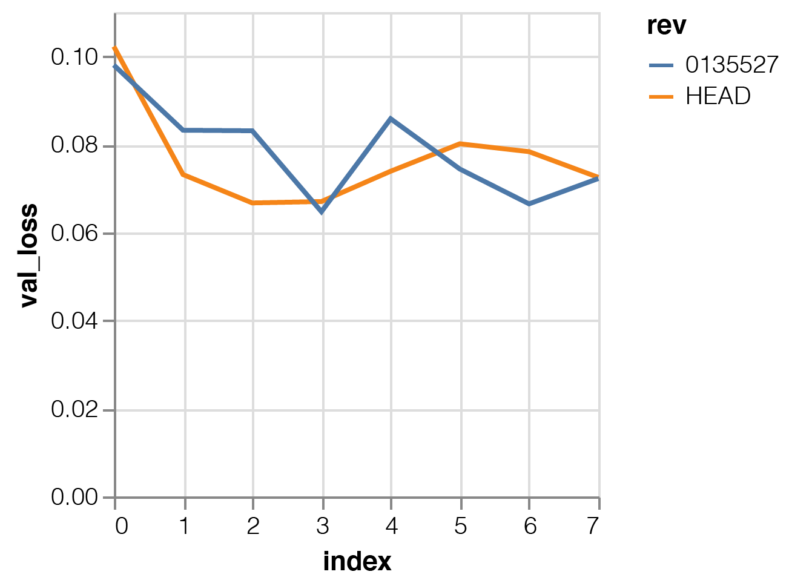

<p align="center">
  
</p>

1. [Overview](#overview)
2. [Usage](#usage)
3. [Getting started](#getting-started)
4. [Using CML with DVC](#using-cml-with-dvc)
5. [Using self-hosted runners](#using-self-hosted-runners)
6. [Examples](#a-library-of-cml-projects)


## Overview
Continuous Machine Learning (**CML**) is a tool for implementing continuous integration & delivery (CI/CD) in 
machine learning projects. Use it to automate parts of your development workflow, including
model training and evaluation, comparing ML experiments across your project history, and 
monitoring changing datasets. 

We built CML with these principles in mind: 

- **GitFlow for data science.** Use GitLab or GitHub to manage ML experiments, track who trained ML models or modified data and when. Codify data and models with DVC instead of pushing to a Git repo.
- **Auto reports for ML experiments.** Auto-generate reports with metrics and plots in each Git Pull Request. Rigorous engineering practices help your team make informed, data-driven decisions. 
- **No additional services.** Build you own ML platform using just GitHub or GitLab and your favorite cloud services: AWS, Azure, GCP. No databases, services or complex setup needed.


## Usage
CML extends the Git CI/CD workflow to ML projects. When a pull or push to your project repository is detected, CML coordinates cloud resources to run a user-defined script and return a CML Report to your repository. 

To begin, you'll need a GitHub or GitLab account. Users may wish to familiarize themselves with 
[Github Actions](https://help.github.com/en/actions) or [GitLab CI/CD](https://about.gitlab.com/stages-devops-lifecycle/continuous-integration/). Here, will discuss the GitHub use case. Please see our documentation for details about configuring CML with GitLab [LINK]. 

The key file in any CML project is a `.yaml` configuring your GitHub Action. This file is always stored in `.github/workflows`.

```yaml
name: your-workflow-name

on: [push, pull_request]

jobs:
  run:
    runs-on: [ubuntu-latest]
    container: docker://dvcorg/cml:latest
    steps:
      - uses: actions/checkout@v2
      - name: cml_run
      env:
        repo_token: ${{ secrets.GITHUB_TOKEN }}
      run: |
        
        # Your ML workflow goes here
        python train.py
        
        # Write your CML report
        cat results.txt >> report.md
        cml-send-comment report.md
```

### CML Functions
CML provides a number of helper functions to help package outputs from ML workflows, such as numeric data and data vizualizations about model performance, into a CML report. 

|  Function | Description  | Inputs  | 
|---|---|---|
| `cml-send-comment`  | Return CML report as a comment in your GitHub/GitLab workflow. | `<path to report> --head-sha <sha>`   | 
| `cml-send-github-check`  | Return CML report as a check in GitHub   | `<path to report> --head-sha <sha>` |
| `cml-publish` | Publish an image for writing to CML report. Returns `.md` string to embed image in CML report when `--md` flag is present. | `<path to image> --title <image title> --md` |

### Customizing your CML report
CML reports are written in [GitHub Flavored Markdown](https://github.github.com/gfm/). That means they can contain images, tables, formatted text, HTML blocks, code snippets and more- really, what you put in a CML report is up to you. Some examples:

📝  **Text**. Write to your report using whatever method you prefer. For example, copy the contents of a text file containing the results of ML model training:
```
cat results.txt >> report.md 
```
🖼️  **Images** Display images using the markdown or HTML. Note that if an image is an output of your ML workflow (i.e., it is produced by your workflow), you will need to use the `cml-publish` function to include it a CML report. For example, if `graph.png` is the output of my workflow `python train.py`, run:

```
cml-publish graph.png --md >> report.md
```

## Getting started

1. Fork our [example project repository](https://github.com/iterative/example_cml). 



The following steps can all be done in the GitHub browser interface. However, to follow along the commands, we recommend cloning your fork to your local workstation:

```bash
git clone https://github.com/<your-username>/example_cml
```

2. To create a CML workflow, copy the following into a new file, `.github/workflows/cml.yaml`:

```yaml
name: model-training

on: [push, pull_request]

jobs:
  run:
    runs-on: [ubuntu-latest]
    container: docker://dvcorg/cml-py3:latest
    steps:
      - uses: actions/checkout@v2
      - name: cml_run
        env:
          repo_token: ${{ secrets.GITHUB_TOKEN }}
        run: |
          pip install -r requirements.txt
          python train.py
        
          cat metrics.txt >> report.md
          cml-publish confusion_matrix.png --md >> report.md
          cml-send-github-check report.md
```

3. As soon as this file is pushed to your GitHub repository, you'll trigger your first GitHub Action. 

```bash
git add . && git commit -m "create workflow"
git push origin master
```

Now you can look in your GitHub Actions dashboard. You'll see a workflow, named according to your last commit message, hopefully with a yellow dot beside it. The dot means your Action is running. 



When the dot turns into a green check, the Action has completed. Click on the workflow, then in the lefthand pane under "model-training", click on "CML Report" to view your report. 



4. Cool, that's your first report! Now it's time to modify your code and see what happens.  Let's make a new branch for experimenting. In your local workspace:

```bash
git checkout -b experiment
```

5. In your text editor of choice, edit line X of `train.py` to `depth = 5`. We're also going to add final line to our `cml.yaml` file. The last two lines should read: 

```yaml
          cml-send-github-check report.md
          cml-send-comment report.md
```

6. Commit and push the changes:

```bash
git add . && git commit -m "modify forest depth"
git push origin experiment
```

7. In GitHub, open up a Pull Request to compare the `experiment` branch to `master`. You'll first see some checks appear- this is the result of the function `cml-send-github-check` in your workflow. 



Shortly, you should see a comment from `github-actions` appear in the Pull Request with your CML report. This is a result of the function `cml-send-comment` in your workflow.




This is the gist of the CML workflow: when you push changes to your GitHub repository, the workflow in your `.github/workflows/*.yaml` file gets run. CML functions let you display relevant results from the workflow, like model performance metrics and vizualizations, in GitHub checks and comments. Now, every Pull Request in your project is accompanied with a report, visible to you and any collaborators. What kind of workflow you want to run, and want to put in your CML report, is up to you. 


## Using CML with DVC
CML works without DVC, but some DVC features are well-suited for CML. For example, DVC helps you push and pull large files, like models and datasets, from cloud storage to your runner and back. DVC also lets you visualize how metrics differ between commits to make reports like this:


If you're using a DVC remote, take note of the environmental variables that must be set according to your remote storage format. 

<details>
  <summary>
  S3 and S3 compatible storage (Minio, DigitalOcean Spaces, IBM Cloud Object Storage...)
  </summary>

```yaml
# Github
env:
  AWS_ACCESS_KEY_ID: ${{ secrets.AWS_ACCESS_KEY_ID }}
  AWS_SECRET_ACCESS_KEY: ${{ secrets.AWS_SECRET_ACCESS_KEY }}
  AWS_SESSION_TOKEN: ${{ secrets.AWS_SESSION_TOKEN }}
```

> :point_right: AWS_SESSION_TOKEN is optional.

</details>

<details>
  <summary>
  Azure
  </summary>

```yaml
env:
  AZURE_STORAGE_CONNECTION_STRING:
    ${{ secrets.AZURE_STORAGE_CONNECTION_STRING }}
  AZURE_STORAGE_CONTAINER_NAME: ${{ secrets.AZURE_STORAGE_CONTAINER_NAME }}
```

</details>

<details>
  <summary>
  Aliyn
  </summary>

```yaml
env:
  OSS_BUCKET: ${{ secrets.OSS_BUCKET }}
  OSS_ACCESS_KEY_ID: ${{ secrets.OSS_ACCESS_KEY_ID }}
  OSS_ACCESS_KEY_SECRET: ${{ secrets.OSS_ACCESS_KEY_SECRET }}
  OSS_ENDPOINT: ${{ secrets.OSS_ENDPOINT }}
```

</details>

<details>
  <summary>
  Google Storage
  </summary>

> :warning: Normally, GOOGLE_APPLICATION_CREDENTIALS points to the path of the
> json file that contains the credentials. However in the action this variable
> CONTAINS the content of the file. Copy that json and add it as a secret.

```yaml
env:
  GOOGLE_APPLICATION_CREDENTIALS: ${{ secrets.GOOGLE_APPLICATION_CREDENTIALS }}
```

</details>

<details>
  <summary>
  Google Drive
  </summary>

> :warning: After configuring your
> [Google Drive credentials](https://dvc.org/doc/command-reference/remote/add)
> you will find a json file at
> `your_project_path/.dvc/tmp/gdrive-user-credentials.json`. Copy that json and
> add it as a secret.

```yaml
env:
  GDRIVE_CREDENTIALS_DATA: ${{ secrets.GDRIVE_CREDENTIALS_DATA }}
```
</details>

### Using DVC metrics to compare commits
Another benefit of DVC is the ability to compare performance metrics across project versions within a CML report. For example, to compare the current project state on a feature branch with master: 

```
git fetch --prune --unshallow
BASELINE=origin/master

dvc metrics diff --show-md "$BASELINE" >> report.md
dvc diff --show-json "$BASELINE" | cml-files >> report.md
```

Below is an example of a `dvc metrics diff` table in a CML report showing three metrics: precision, recall, and accuracy on a classification problem.



Similarly, `dvc plots diff` can be used to generate metrics vizualizations comparing the current version with another:

```
git fetch --prune --unshallow
dvc plots diff --target loss.csv --show-vega master | cml-publish --md >> report.md
```

Here's how a sample `dvc plots diff` would appear in a CML report:




### The DVC run-cache
DVC 1.0 uses a run-cache to avoid duplicating computations if a pipeline stage has already been run. In CI/CD, run-cache also removes the need to commit to save the results of a workflow (such as a trained model file).

Run-cache is accessed and written to locally, so to take advantage of it in CML, you'll need to `dvc push` the cache from your workspace,`dvc pull` to the runner before reproducing your pipeline, and then `dvc push` the cache after. 

```
dvc pull --run-cache
dvc repro
dvc push --run-cache
          
   ```

## Using self-hosted runners
GitHub provides a certain amount of time on hosted runners for free to every user. However, there are many great reasons to use your own runners- to take advantage of GPUs, to orchestrate your team's shared computing resources, or to [one more reason goes here].

☝️ **Tip!** Check out the [official GitHub documentation](https://help.github.com/en/actions/hosting-your-own-runners/about-self-hosted-runners) to get started setting up your self-hosted runner.

### CML with GPUs
We've provided a docker image that supports most modern GPUs. To use it, modify your `.yaml` file, modify the `runs-on` field as follows:

```yaml
runs-on: [self-hosted]
  container:
    image: docker://dvcorg/cml-gpu:latest
    options: --runtime "nvidia" -e NVIDIA_VISIBLE_DEVICES=all

```

The image runs Ubutnu 18.04 and supports cuda 10.1, libcudnn 7, cublas 10, and libinfer 10. Please also be sure to have nvidia drivers and nvidia-docker installed on your self-hosted runner:

```bash
sudo ubuntu-drivers autoinstall
sudo apt-get install nvidia-docker2
sudo systemctl restart docker
```


## A library of CML projects
Here are some example projects using CML.
- [CML in a classification problem](https://github.com/andronovhopf/1_base_case)
- [Using CML with DVC](https://github.com/andronovhopf/prettypretty)
- [Making a tensorboard CML report](https://github.com/andronovhopf/3_tensorboard)
