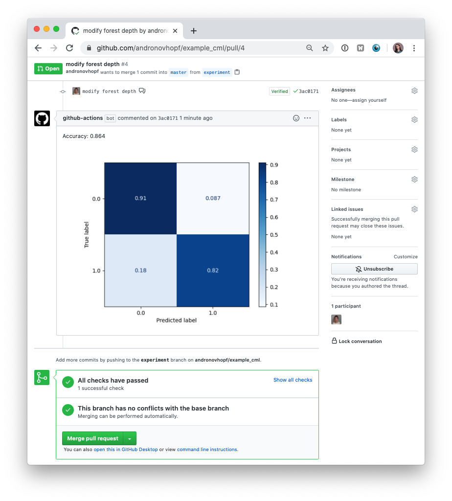
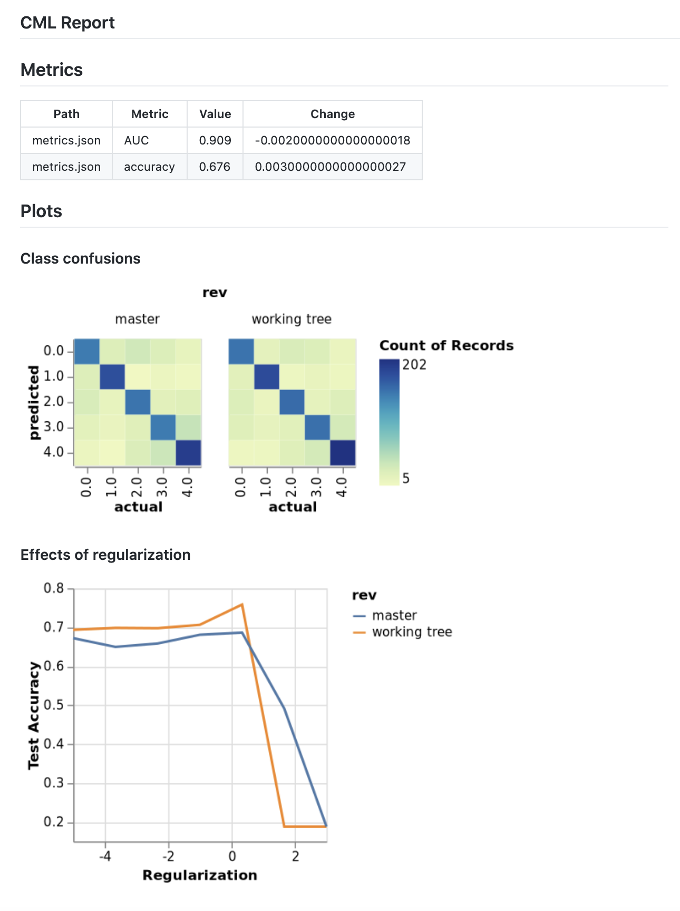

<p align="center">
  
</p>

1. [Overview](#overview)
2. [Usage](#usage)
3. [Getting started](#getting-started)
4. [Using CML with DVC](#using-cml-with-dvc)
5. [Using self-hosted runners](#using-self-hosted-runners)
6. [Examples](#a-library-of-cml-projects)


## Overview
Continuous Machine Learning (**CML**) is a tool for implementing continuous integration & delivery (CI/CD) in 
machine learning projects. Use it to automate parts of your development workflow, including
model training and evaluation, comparing ML experiments across your project history, and 
monitoring changing datasets. 

We built CML with these principles in mind: 

- **GitFlow for data science.** Use GitLab or GitHub to manage ML experiments, track who trained ML models or modified data and when. Codify data and models with [DVC](https://dvc.org) instead of pushing to a Git repo.
- **Auto reports for ML experiments.** Auto-generate reports with metrics and plots in each Git Pull Request. Rigorous engineering practices help your team make informed, data-driven decisions. 
- **No additional services.** Build you own ML platform using just GitHub or GitLab and your favorite cloud services: AWS, Azure, GCP. No databases, services or complex setup needed.


## Usage
You'll need a GitHub or GitLab account to begin. Users may wish to familiarize themselves with 
[Github Actions](https://help.github.com/en/actions) or [GitLab CI/CD](https://about.gitlab.com/stages-devops-lifecycle/continuous-integration/). Here, will discuss the GitHub use case. Please see our documentation for details about configuring CML with GitLab [LINK]. 

The key file in any CML project is `.github/workflows/cml.yaml`.

```yaml
name: your-workflow-name

on: [push]

jobs:
  run:
    runs-on: [ubuntu-latest]
    container: docker://dvcorg/cml:latest
    steps:
      - uses: actions/checkout@v2

      - name: cml_run
      env:
        repo_token: ${{ secrets.GITHUB_TOKEN }}
      run: |

        
        # Your ML workflow goes here
        python train.py
        
        # Write your CML report
        cat results.txt >> report.md
        cml-send-comment report.md
```

### CML Functions
CML provides a number of helper functions to help package outputs from ML workflows, such as numeric data and data vizualizations about model performance, into a CML report. 

|  Function | Description  | Inputs  | 
|---|---|---|
| `cml-send-comment`  | Return CML report as a comment in your GitHub/GitLab workflow. | `<path to report> --head-sha <sha>`   | 
| `cml-send-github-check`  | Return CML report as a check in GitHub   | `<path to report> --head-sha <sha>` |
| `cml-publish` | Publish an image for writing to CML report. | `<path to image> --title <image title> --md` |

### Customizing your CML report
CML reports are written in [GitHub Flavored Markdown](https://github.github.com/gfm/). That means they can contain images, tables, formatted text, HTML blocks, code snippets and more- really, what you put in a CML report is up to you. Some examples:


📝  **Text**. Write to your report using whatever method you prefer. For example, copy the contents of a text file containing the results of ML model training:
```
cat results.txt >> report.md 

```
🖼️  **Images** Display images using the markdown or HTML. Note that if an image is an output of your ML workflow (i.e., it is produced by your workflow), you will need to use the `cml-publish` function to include it a CML report. For example, if `graph.png` is the output of my workflow `python train.py`, run:

```
cml-publish graph.png --md >> report.md
```

## Getting started

1. Fork our [example project repository](https://github.com/iterative/example_cml). 


The following steps can all be done in the GitHub browser interface. However, to follow along the commands, we recommend cloning your fork to your local workstation:

```bash
git clone https://github.com/<your-username>/example_cml
```

2. To create a CML workflow, copy the following into a new file, `.github/workflows/cml.yaml`:


```yaml
name: model-training

on: [push]

jobs:
  run:
    runs-on: [ubuntu-latest]
    container: docker://dvcorg/cml-py3:latest
    steps:
      - uses: actions/checkout@v2
      - name: cml_run
        env:
          repo_token: ${{ secrets.GITHUB_TOKEN }}
        run: |
          pip install -r requirements.txt
          python train.py
        
          cat metrics.txt >> report.md
          cml-publish confusion_matrix.png --md >> report.md
          cml-send-comment report.md
```


```bash
git checkout -b experiment
```

4. In your text editor of choice, edit line X of `train.py` to `depth = 5`. 

5. Commit and push the changes:

```bash
git add . && git commit -m "modify forest depth"
git push origin experiment
```

6. In GitHub, open up a Pull Request to compare the `experiment` branch to `master`.


Shortly, you should see a comment from `github-actions` appear in the Pull Request with your CML report. This is a result of the function `cml-send-comment` in your workflow.



This is the gist of the CML workflow: when you push changes to your GitHub repository, the workflow in your `.github/workflows/cml.yaml` file gets run and a report generated. CML functions let you display relevant results from the workflow, like model performance metrics and vizualizations, in GitHub checks and comments. What kind of workflow you want to run, and want to put in your CML report, is up to you. 


## Using CML with DVC
In many ML projects, data isn't stored in a Git repository and needs to be downloaded from external sources. DVC is a common way to bring data to your CML runner. DVC also lets you visualize how metrics differ between commits to make reports like this:



The `.github/workflows/cml.yaml` file to create this report is:

```yaml
name: train-test


on: [push]

jobs:
  run:
    runs-on: [ubuntu-latest]
    container: docker://dvcorg/cml-py3:latest

    steps:
      - uses: actions/checkout@v2

      - name: cml_run
        shell: bash
        env:
          repo_token: ${{ secrets.GITHUB_TOKEN }}
          AWS_ACCESS_KEY_ID: ${{ secrets.AWS_ACCESS_KEY_ID }}
          AWS_SECRET_ACCESS_KEY: ${{ secrets.AWS_SECRET_ACCESS_KEY }}
        run: |
          # Install requirements
          pip install -r requirements.txt
          
          # Pull data & run-cache from S3 and reproduce pipeline
          dvc pull data --run-cache
          dvc repro
          
          # Report metrics
          echo "## Metrics" >> report.md 
          git fetch --prune --unshallow
          dvc metrics diff master --show-md >> report.md
          
          # Publish confusion matrix diff
          echo "## Plots<br />### Class confusions" >> report.md
          dvc plots diff --target classes.csv --template confusion -x actual -y predicted --show-vega master > vega.json
          vl2png vega.json -s 1.5 | cml-publish --md --title 'my image' >> report.md
          
          # Publish regularization function diff
          echo "### Effects of regularization\n" >> report.md
          dvc plots diff --target estimators.csv -x Regularization --show-vega master > vega.json
          vl2png vega.json -s 1.5 | cml-publish --md --title 'my 2nd image' >> report.md
        
          
          cml-send-comment report.md 

```

If you're using DVC with cloud storage, take note of environmental variables for your storage format. 

<details>
  <summary>
  S3 and S3 compatible storage (Minio, DigitalOcean Spaces, IBM Cloud Object Storage...)
  </summary>

```yaml
# Github
env:
  AWS_ACCESS_KEY_ID: ${{ secrets.AWS_ACCESS_KEY_ID }}
  AWS_SECRET_ACCESS_KEY: ${{ secrets.AWS_SECRET_ACCESS_KEY }}
  AWS_SESSION_TOKEN: ${{ secrets.AWS_SESSION_TOKEN }}
```

> :point_right: AWS_SESSION_TOKEN is optional.

</details>

<details>
  <summary>
  Azure
  </summary>

```yaml
env:
  AZURE_STORAGE_CONNECTION_STRING:
    ${{ secrets.AZURE_STORAGE_CONNECTION_STRING }}
  AZURE_STORAGE_CONTAINER_NAME: ${{ secrets.AZURE_STORAGE_CONTAINER_NAME }}
```

</details>

<details>
  <summary>
  Aliyn
  </summary>

```yaml
env:
  OSS_BUCKET: ${{ secrets.OSS_BUCKET }}
  OSS_ACCESS_KEY_ID: ${{ secrets.OSS_ACCESS_KEY_ID }}
  OSS_ACCESS_KEY_SECRET: ${{ secrets.OSS_ACCESS_KEY_SECRET }}
  OSS_ENDPOINT: ${{ secrets.OSS_ENDPOINT }}
```

</details>

<details>
  <summary>
  Google Storage
  </summary>

> :warning: Normally, GOOGLE_APPLICATION_CREDENTIALS points to the path of the
> json file that contains the credentials. However in the action this variable
> CONTAINS the content of the file. Copy that json and add it as a secret.

```yaml
env:
  GOOGLE_APPLICATION_CREDENTIALS: ${{ secrets.GOOGLE_APPLICATION_CREDENTIALS }}
```

</details>

<details>
  <summary>
  Google Drive
  </summary>

> :warning: After configuring your
> [Google Drive credentials](https://dvc.org/doc/command-reference/remote/add)
> you will find a json file at
> `your_project_path/.dvc/tmp/gdrive-user-credentials.json`. Copy that json and
> add it as a secret.

```yaml
env:
  GDRIVE_CREDENTIALS_DATA: ${{ secrets.GDRIVE_CREDENTIALS_DATA }}
```
</details>


## Using self-hosted runners
GitHub Actions are run on GitHub-hosted runners by default. However, there are many great reasons to use your own runners- to take advantage of GPUs, to orchestrate your team's shared computing resources, or to train in the cloud.

☝️ **Tip!** Check out the [official GitHub documentation](https://help.github.com/en/actions/hosting-your-own-runners/about-self-hosted-runners) to get started setting up your self-hosted runner.

### Allocating cloud resources with CML
When a workflow requires computational resources, such as GPUs, CML can automatically allocate cloud instances. In the following example, we use [Docker Machine](https://docs.docker.com/machine/concepts/) to provision instances. We also prepared a docker GPU image that self-terminates when the job is done. 


```yaml
name: train-my-model

on: [push]

jobs:
  deploy-cloud-runner:
    runs-on: [ubuntu-latest]
    container: docker://dvcorg/cml-cloud-runner

    steps:
      - name: deploy
        env:
          repo_token: ${{ secrets.REPO_TOKEN }} 
          AWS_ACCESS_KEY_ID: ${{ secrets.AWS_ACCESS_KEY_ID }}
          AWS_SECRET_ACCESS_KEY: ${{ secrets.AWS_SECRET_ACCESS_KEY }}
        run: |
          echo "Deploying..."

          MACHINE="CML-$(openssl rand -hex 12)"
          docker-machine create \
              --driver amazonec2 \
              --amazonec2-instance-type t2.micro \
              --amazonec2-region us-east-1 \
              --amazonec2-zone f \
              --amazonec2-vpc-id vpc-06bc773d85a0a04f7 \
              --amazonec2-ssh-user ubuntu \
              $MACHINE

          eval "$(docker-machine env --shell sh $MACHINE)"

          ( 
          docker-machine ssh $MACHINE "sudo mkdir -p /docker_machine && sudo chmod 777 /docker_machine" && \
          docker-machine scp -r -q ~/.docker/machine/ $MACHINE:/docker_machine && \

          docker run --name runner -d \
            -v /docker_machine/machine:/root/.docker/machine \
            -e RUNNER_IDLE_TIMEOUT=120 \
            -e DOCKER_MACHINE=${MACHINE} \
            -e RUNNER_LABELS=cml \
            -e repo_token=$repo_token \
            -e RUNNER_REPO=https://github.com/iterative/cml_base_case \
           dvcorg/cml-cloud-runner && \

          sleep 20 && echo "Deployed $MACHINE"
          ) || (echo y | docker-machine rm $MACHINE && exit 1)

  train:
    needs: deploy
    runs-on: [self-hosted,cml]

    steps:
      - uses: actions/checkout@v2

      - name: cml_run
        env:
          repo_token: ${{ secrets.GITHUB_TOKEN }} 
        run: |
          pip install -r requirements.txt
          python train.py
        
          cat metrics.txt >> report.md
          cml-publish confusion_matrix.png --md >> report.md
          cml-send-comment report.md

```

## A library of CML projects
Here are some example projects using CML.
- [Basic CML project](https://github.com/iterative/cml_base_case)
- [CML with DVC to pull data](https://github.com/iterative/cml_dvc_case)
- [CML with Tensorboard](https://github.com/iterative/cml_tensorboard_case)
