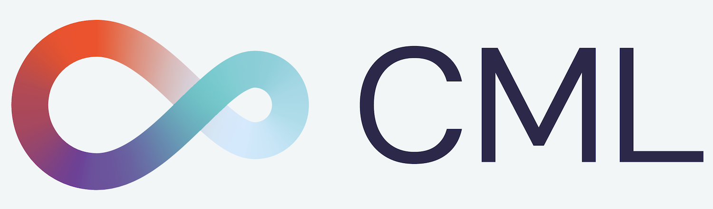

# Continuous Machine Learning




## Introduction
Continuous Machine Learning (**CML**) is a tool for implementing continuous integration & delivery (CI/CD) in 
machine learning projects. Use it to automate parts of your development workflow, including
model training and evaluation, comparing ML experiments across your project history, and 
monitoring changing datasets. 

The core values of CML are:

- **GitFlow for data science.** Use GitLab or GitHub to manage ML experiments, track who trained ML models or modified data and when. Codify data and models with DVC instead of pushing to a Git repo.
- **Auto reports for ML experiments.** Auto-generate reports with metrics and plots in each Git Pull Request. Rigorous engineering practices help your team make informed, data-driven decisions. 
- **No additional services.** Build you own ML platform using just GitHub or GitLab and your favorite cloud services: AWS, Azure, GCP. No databases, services or complex setup needed.

## Usage
CML extends the Git CI/CD workflow to ML projects. When a pull or push to your project repository is detected, CML coordinates cloud resources to run a user-defined script and return a CML Report to your repository. 

To begin, you'll need a GitHub or GitLab account. Users may wish to familiarize themselves with 
[Github Actions](https://help.github.com/en/actions) or [GitLab CI/CD](https://about.gitlab.com/stages-devops-lifecycle/continuous-integration/). Here, will discuss the GitHub use case. Please see our documentation for details about configuring CML with GitLab [LINK]. 

`.github/workflows/cml.yml`

```yaml
name: your-workflow-name

on: [push, pull_request]

jobs:
  run:
    runs-on: [ubuntu-latest]
    container: docker://dvcorg/cml:latest
    steps:
      - uses: actions/checkout@v2
      - name: cml_run
      env:
        repo_token: ${{ secrets.GITHUB_TOKEN }}
      run: |
        
        # Your workflow goes here. It could be anything! 
        # But let's say it's this:
        python train.py
        
        cat results.txt >> report.md
        cml-publish graph.png --md >> report.md
        cml-send-github-check report.md
```

### CML Functions
CML provides a number of helper functions to help package outputs from ML workflows, such as numeric data and data vizualizations about model performance, into a CML report. 

|  Function | Description  | Inputs  | 
|---|---|---|
| `cml-send-comment`  | Return CML report as a comment in your GitHub/GitLab workflow. | `<path to report> --head-sha <sha>`   | 
| `cml-send-github-check`  | Return CML report as a check in GitHub   | `<path to report> --head-sha <sha>` |
| `cml-publish` | Publish an image for writing to CML report. Returns `.md` string to embed image in CML report when `--md` flag is present. | `<path to image> --title <image title> --md` |

### Customizing your CML report
CML reports are written in [GitHub Flavored Markdown](https://github.github.com/gfm/). That means they can contain images, tables, formatted text, HTML blocks, code snippets and more- really, what you put in a CML report is up to you. Some examples:

📝 **Text**. Write to your report using whatever method you prefer. For example, copy the contents of a text file containing the results of ML model training:
```
cat results.txt >> report.md 
```
🖼️ **Images** Display images using the syntax ``. Note that if an image is an output of your ML workflow (i.e., it is produced by your workflow), you will need to use the `cml-publish` function to include it a CML report. For example, if `graph.png` is the output of my workflow `python train.py`, run:

```
cml-publish graph.png --md >> report.md
```


## Using CML with DVC
CML facilitates pushing and pulling large files, such as models and datasets, to remote storage with DVC. If you are using a DVC remote, take note of the environmental variables that must be set according to your remote storage format. 

<details>
  <summary>
  S3 and S3 compatible storage (Minio, DigitalOcean Spaces, IBM Cloud Object Storage...)
  </summary>

```yaml
# Github
env:
  AWS_ACCESS_KEY_ID: ${{ secrets.AWS_ACCESS_KEY_ID }}
  AWS_SECRET_ACCESS_KEY: ${{ secrets.AWS_SECRET_ACCESS_KEY }}
  AWS_SESSION_TOKEN: ${{ secrets.AWS_SESSION_TOKEN }}
```

> :point_right: AWS_SESSION_TOKEN is optional.

</details>

<details>
  <summary>
  Azure
  </summary>

```yaml
env:
  AZURE_STORAGE_CONNECTION_STRING:
    ${{ secrets.AZURE_STORAGE_CONNECTION_STRING }}
  AZURE_STORAGE_CONTAINER_NAME: ${{ secrets.AZURE_STORAGE_CONTAINER_NAME }}
```

</details>

<details>
  <summary>
  Aliyn
  </summary>

```yaml
env:
  OSS_BUCKET: ${{ secrets.OSS_BUCKET }}
  OSS_ACCESS_KEY_ID: ${{ secrets.OSS_ACCESS_KEY_ID }}
  OSS_ACCESS_KEY_SECRET: ${{ secrets.OSS_ACCESS_KEY_SECRET }}
  OSS_ENDPOINT: ${{ secrets.OSS_ENDPOINT }}
```

</details>

<details>
  <summary>
  Google Storage
  </summary>

> :warning: Normally, GOOGLE_APPLICATION_CREDENTIALS points to the path of the
> json file that contains the credentials. However in the action this variable
> CONTAINS the content of the file. Copy that json and add it as a secret.

```yaml
env:
  GOOGLE_APPLICATION_CREDENTIALS: ${{ secrets.GOOGLE_APPLICATION_CREDENTIALS }}
```

</details>

<details>
  <summary>
  Google Drive
  </summary>

> :warning: After configuring your
> [Google Drive credentials](https://dvc.org/doc/command-reference/remote/add)
> you will find a json file at
> `your_project_path/.dvc/tmp/gdrive-user-credentials.json`. Copy that json and
> add it as a secret.

```yaml
env:
  GDRIVE_CREDENTIALS_DATA: ${{ secrets.GDRIVE_CREDENTIALS_DATA }}
```
</details>

### Using DVC metrics to compare commits
Another benefit of DVC is the ability to compare performance metrics across project versions within a CML report. For example, to compare the current project state on a feature branch with master: 

```
git fetch --prune --unshallow
BASELINE=origin/master

dvc metrics diff --show-md "$BASELINE" >> report.md
dvc diff --show-json "$BASELINE" | cml-files >> report.md
```

Below is an example of a `dvc metrics diff` table in a CML report showing three metrics: precision, recall, and accuracy on a classification problem.


Similarly, `dvc plots diff` can be used to generate metrics vizualizations comparing the current version with another:

```
git fetch --prune --unshallow
dvc plots diff --target loss.csv --show-vega master | cml-publish --md >> report.md
```

### The DVC run-cache
DVC 1.0 uses a run-cache to avoid duplicating computations if a pipeline stage has already been run. In CI/CD, run-cache also removes the need to commit to save the results of a workflow (such as a trained model file).

Run-cache is accessed locally, so to take advantage of this feature in CML, you'll need to `dvc push` the cache from your workspace,`dvc pull` to the runner before reproducing your pipeline, and then `dvc push` the cache after. 

```
dvc pull --run-cache
dvc repro
dvc push --run-cache
          
   ```

## Using CML with self-hosted runners
GitHub provides a certain amount of time on hosted runners for free to every user. However, there are many great reasons to use your own runners- to take advantage of GPUs, to orchestrate your team's shared computing resources, or to [one more reason goes here].

☝️ **Tip!** Check out the [official GitHub documentation](https://help.github.com/en/actions/hosting-your-own-runners/about-self-hosted-runners) to get started setting up your self-hosted runner.

### CML with GPUs
We've provided a docker image that supports most modern GPUs. To use it, modify your `.yaml` file, modify the `runs-on` field as follows:

```yaml
runs-on: [self-hosted]
  container:
    image: docker://dvcorg/cml-gpu:latest
    options: --runtime "nvidia" -e NVIDIA_VISIBLE_DEVICES=all

```

The image runs Ubutnu 18.04 and supports cuda 10.1, libcudnn 7, cublas 10, and libinfer 10. Please also be sure to have nvidia drivers and nvidia-docker installed on your self-hosted runner:

```bash
sudo ubuntu-drivers autoinstall
sudo apt-get install nvidia-docker2
sudo systemctl restart docker
```

## Getting started

1. In a new project directory, create a training script:

```bash
mkdir mycml && cd mycml
git init
touch train.py
```

2. Copy the following code into `train.py`.

>> CODE GOES HERE

3. Create a new GitHub repository, make your first commit, and push to sync your local workspace and repo.

```bash
git add . & git commit -m "first commit"
git push origin master
```

4. Now it's time to create your CML workflow: copy the following script into a new file, `.github/workflows/cml.yaml`:

```yaml
name: model-training

on: [push, pull_request]

jobs:
  run:
    runs-on: [ubuntu-latest]
    container: docker://dvcorg/cml:latest
    steps:
      - uses: actions/checkout@v2
      - name: cml_run
      env:
        repo_token: ${{ secrets.GITHUB_TOKEN }}
      run: |

        python train.py
        
        cat results.txt >> report.md
        cml-publish graph.png --md >> report.md
        cml-send-github-check report.md
```

5. Now it's time to run the workflow for the first time. All you have to do is commit and push!

```bash
git add . & git commit -m "workflow created"
git push origin master
```


6. OK, now it's time to modify your code and see what happens. Let's make a new branch for experimenting. In your local workspace:

```bash
git checkout -b experiment
```

7. In your text editor of choice, edit line X of `train.py` to ______. Then, commit and push the change:

```bash
git add . & git commit -m "update learning rate"
```

8. Make a PR in Github [SCREENSHOT]

No wait and watch- voila! Here's your report. 
